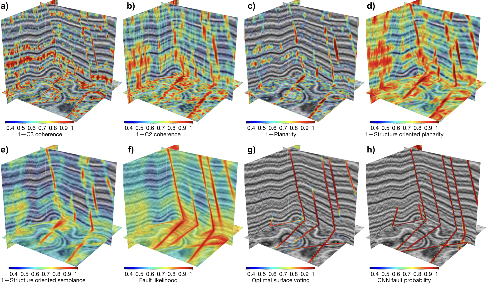

# FaultSeg: using synthetic datasets to train an end-to-end CNN for 3D fault segmentation

**This is a [Keras](https://keras.io/) version of FaultSeg implemented by [Xinming Wu](http://www.jsg.utexas.edu/wu/) for 3D fault segmentation**

As described in **FaultSeg: using synthetic datasets to train an end-to-end CNN for 3D fault segmentation** by [Xinming Wu](http://www.jsg.utexas.edu/wu/)1, 
[Luming Liang](https://sites.google.com/site/lumingliangshomepage/)2, 
[Yunzhi Shi](https://scholar.google.com/citations?user=t9dQMgIAAAAJ&hl=en)1 and 
[Sergey Fomel](https://www.jsg.utexas.edu/researcher/sergey_fomel/)1.
1BEG, UT Austin; 2Uber.

## Getting Started with Example Model for fault prediction

If you would just like to try out a pretrained example model, then you can download the [pretrained model](...) and use the 'prediction.ipynb' script to run a demo.

### Dataset

**To train our CNN network, we automatically created 200 pairs of synthetic seismic and corresponding fault volumes, which were shown 
to be sufficient to train a good fault segmentation network.** 

**The training and validation datasets can be downloaded [here](...)**

### Training

Run train3 to start training a new faultSeg model by using the 200 synthetic datasets

## Publications

If you find this work helpful in your research, please cite:

    @article{wu2018faultSeg,
        author = {Xinming Wu, Luming Liang, Yunzhi Shi and Sergey Fomel},
        title = {FaultSeg: using synthetic datasets to train an end-to-end CNN for 3D fault segmentation},
        journal = {GEOPHYSICS},
        volume = {submitted},
        number = { },
        pages = { },
        year = {2018},
    }

---
## Validation on a synthetic example
Fault detections are computed on a syntehtic seismic image by using 8 methods of C3 (Gersztenkorn and Marfurt, 1999),
C2 (Marfurt et al., 1999), planarity (Hale, 2009), structure-oriented linearity (Wu, 2017), structure-oriented semblance (Hale, 2009), fault likelihood (Hale, 2013; Wu and Hale, 2016), optimal surface voting (Wu and Fomel, 2018) and our CNN-based segmentation.

**To quantitatively evaluate the fault detection methods, we further calculate the precision-recall (Martin et al., 2004) and receiver operator characteristic (ROC) (Provost et al., 1998) curves shown below. From the precision-recall curves, we can clearly observe that our CNN method (red curve) provides the highest precisions for all the choices of recall.**

---
## Validation on multiple field examples

Although trained by only synthetic datasets, the CNN model works well in 
predicting faults in field datasets that are acquired at totally different surveys. 

### Example of Netherlands off-shore F3 (provided by the Dutch Government through TNO and dGB Earth Sciences)

compare the CNN fault probability (top right) with fault likelihood (bottom)

---
### Example of Clyde (provided by Clyde through Paradigm)

compare the CNN fault probability (middle) with fault likelihood (right)

---
### Example of Costa Rica (acquired in the subduction zone, Costa Rica Margin, provided by Nathan Bangs)

compare the CNN fault probability (left column) with fault likelihood (right column)

---
### Example of Campos (acquired at the Campos Basin, offshore Brazil, provided by Michacle Hudec)

---
### Example of [Kerry-3D](https://wiki.seg.org/wiki/Kerry-3D) (The fault features have been thinned in this example)

---
### Example of [Opunake-3D](https://wiki.seg.org/wiki/Opunake-3D) (The fault features have been thinned in this example)

## License

This extension to the Keras library is released under a creative commons license which allows for personal and research use only. 
For a commercial license please contact the authors. You can view a license summary here: http://creativecommons.org/licenses/by-nc/4.0/
